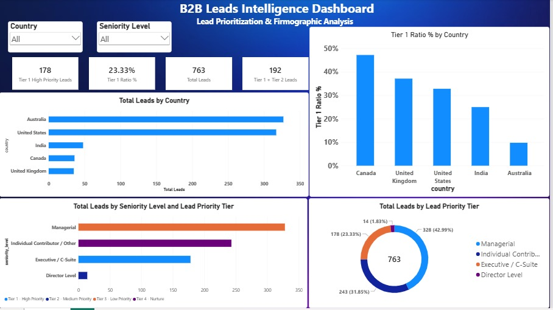

# B2B Lead Intelligence & Firmographic Analysis

## 📊 Project Overview & Executive Summary
This project engineered an end-to-end data processing and analytics pipeline to optimize an international database of **763 corporate leads**. By standardizing, enriching, and segmenting data across a multi-tool lifecycle (**Python ➔ MySQL ➔ Power BI**), I established a structured lead intelligence model to replace flat, unorganized telemetry.

Because the raw dataset lacked pre-defined buyer targeting constraints, I designed a strategic prioritization framework based on corporate seniority levels. The final metrics reveal that while **Australia holds the largest overall market volume with 327 accounts**, the **United States provides the deepest target footprint with 104 Tier-1 High-Priority enterprise decision-makers.**

---

## 🛠️ Data Pipeline & Architecture Workflow
The project architecture maps an active, non-destructive data engineering pipeline designed for clean schema isolation and business maintainability:

1. **Data Cleansing & Ingestion (Python):** Processed raw text fields via `Pandas` to remove leading/trailing whitespaces, correct string capitalization anomalies, eliminate duplicate records, and safely resolve missing values using descriptive markers.
2. **Feature Enrichment (Python):** Engineered programmatic keyword arrays to evaluate raw job titles, parse them into systematic seniority brackets, and dynamically extract corporate email domains.
3. **Database Layer (MySQL):** Abstracted calculation rows into a performant relational database layer, utilizing a database view (`CREATE VIEW`) to isolate business logic and ensure the workflow remains flexible to changing sales rules.
4. **Data Visualization (Power BI):** Developed an executive dashboard visualizing macro market concentrations, job level distributions, and cross-market segment matrices.

---

## 📁 Dataset & Firmographic Architecture
The analytics framework leverages explicit corporate fields to capture organizational profiles:
* **Core Contact Telemetry:** Decision Maker Name, First/Last Name Splits, Corporate E-mail Address, and Authenticated Web Domain.
* **Firmographic Categories:** Market Country, Professional Industry Segment, and Standardized Job Level Hierarchy.
* **Strategic Prioritization Tiers:**
  * **Tier 1 - High Priority (Executive / C-Suite):** Target accounts holding ultimate budgeting ownership and contract signature authority.
  * **Tier 2 - Medium Priority (Director Level):** Departmental budget managers and solution architecture evaluators.
  * **Tier 3 - Low Priority (Managerial):** Operational teams capable of user-level pilots requiring internal upward escalation.
  * **Tier 4 - Nurture (Individual Contributor / Other):** Automated low-overhead marketing communication segments.

---

## 📈 Key Market Insights
*The active Power BI dashboard maps clear business opportunities within the processed pipeline:*

* **Premium Executive Footprint:** The **United States holds a dominant 58.4% of the entire database's executive footprint** (104 out of 178 total Tier-1 C-Suite leads), making it the single deepest market for enterprise contracts.
* **Target Value Concentration Density:** **Canada** presents the highest relative conversion density, yielding **17 Executive/C-Suite contacts out of 36 regional profiles (47.22%)**, closely followed by the **United Kingdom at 37.14%** and the **United States at 32.81%**.
* **Regional Volume Dominance:** **Australia** represents your largest raw pipeline footprint with **327 accounts**, but it is heavily weighted toward lower-tier execution lines (**163 Individual Contributors**). 
* **Pipeline Structural Friction:** Across the overall database view, **Managerial (328)** and **Individual Contributors (243)** represent the dominant platform footprint, outnumbering direct **Executive/C-Suite decision-makers (178)**.

---

## 📊 Dashboard View
Below is the visual analytical model engineered to communicate core pipeline distributions to business stakeholders:

---

## 🚀 Strategic Sales Operations Recommendations
1. **Deploy Enterprise ABM Campaigns for the US Market:** Maximize the footprint within the **United States**. Because it holds over half of your premium buyers (104 C-Suite leads), allocate dedicated sales development resources to target these enterprise accounts.
2. **Prioritize Canadian Outbound Outreach:** Deploy direct manual sales assets into Canadian targets immediately. Since **Canada contains an unmatched 47.22% target tier concentration ratio**, it provides the lowest conversion friction for high-value closures.
3. **Automate Lower-Tier Marketing for Australia:** Avoid assigning expensive sales developer time to the Australian pipeline. Because it holds a heavy baseline of **163 individual contributors**, route this region through automated inbound content drip loops to scale efficiency.
